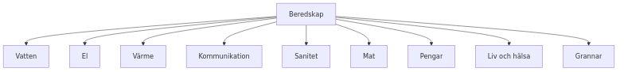

# Information – Brf Glasera (September 2026)

## Beredskapsinformations- och loppisdag: Lördag 26/9

**Beredskapsveckan**, är en informationsinsats som genomförs vecka 39 varje år, ledd av Myndigheten
för civilt försvar (MCF). Syftet att öka människors motståndskraft inför kriser genom att sprida
kunskap om beredskap. Under veckan genomförs olika aktiviteter/seminarier för att stärka
kommuners beredskap och riskkommunikation.

I Värmdö kommun erbjuds t.ex en intressant kväll på Kulturhuset torsdag 24/9: ["ODLA ÄTBART – en
kväll om mat, jord, natur och beredskap"](https://www.varmdo.se/upplevaochgora/evenemang/evenemangsarkiv/odlaatbartenkvallommatjordnaturochberedskap.5.467d267619ed4689c71ab4a.html). Begränsat antal platser. Sista anmälningsdag 21 september.

I vår förening kommer vi att ha en tipsrunda på gården och information/diskussion kring ämnet
beredskap och i anslutning till det grillning. (Temat för 2026 är "Du är en del av Sveriges
totalförsvar" vilket lyfter vikten av att alla bidrar till samhällets beredskap).

Tipsrundan sätts upp under fm och information/diskussion i samband med grillning vid 12 tiden.

Under **förmiddagen** kan man passa på att samla ihop sånt man ej längre önskar ha kvar och se efter
om någon annan nytta av det kan ha. En liten **loppis på gården kl 10-12**. Skänka, sälja eller byta saker
med varandra.

Vi kommer denna dag att rensa rullstolsrummen från sånt som ej hör dit så om du har ställt något där
vänligen placera det i eget förråd. Rullstolsrummen är till för rullstolar och rullatorer. Barnvagnar får
förvaras tillfälligt i rullstolsrummen enbart om de inte blockerar tillgänglighet till
rullstolarna/rullatorer.

## Och så några ord om brandskydd

Information kring brandsäkerhet har tidigare delats ut och finns på hemsidan. Ett litet tips vid behov
av byte batteri i brandvarnaren.

**Tips:** Du som är 67 år eller äldre kan få hjälp av kommunens fixartjänst med olika enklare bestyr i hemmet där finns risk för fall, tex byta batteri i brandvarnare.

* **Telefon:** [073-688 60 02](tel:0736886002) (även SMS går bra)
* **Telefontider:** Vardagar kl. 07.30–9.00 samt 15.00–16.00
* **E-post:** [fixartjansten@varmdo.se](mailto:fixartjansten@varmdo.se)